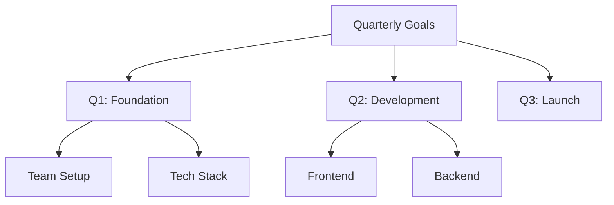
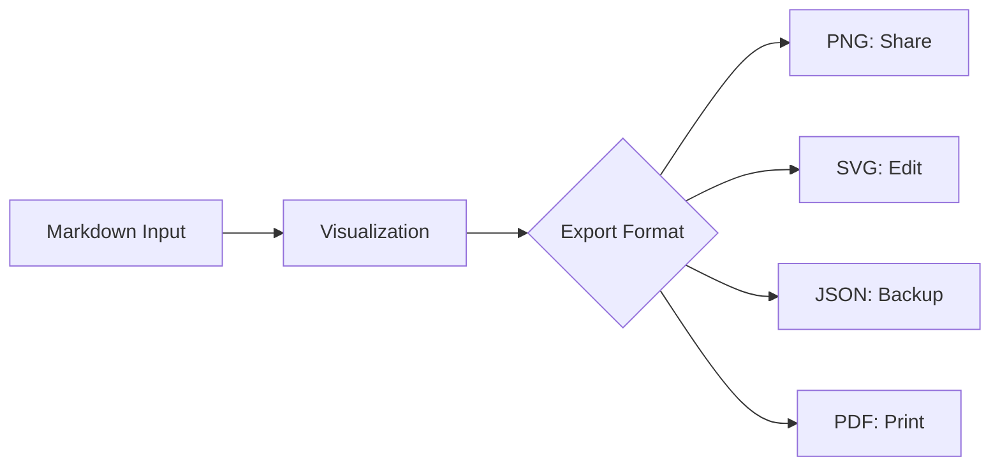
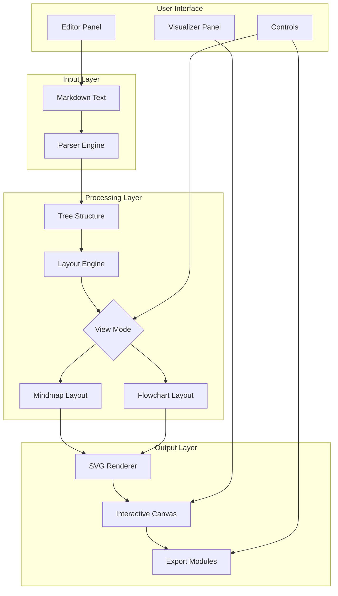

# Notionless • Markdown to Visualizer


**Transform structured Markdown into interactive visual diagrams instantly.** A privacy-first, zero-installation tool that runs entirely in your browser.

---

## 📋 Table of Contents

- [🚀 Quick Start (Under 60 Seconds)](#-quick-start-under-60-seconds)
- [🎯 Why Notionless Exists](#-why-notionless-exists)
- [🔄 Before vs After](#-before-vs-after)
- [✨ Features](#-features)
- [📱 Installation & Usage](#-installation--usage)
- [🎨 Visual Modes](#-visual-modes)
- [📊 Export Options](#-export-options)
- [🧩 Project Architecture](#-project-architecture)
- [🤝 Contributing](#-contributing)
- [📄 License](#-license)
- [👤 Author & Contact](#-author--contact)

---

## 🚀 Quick Start (Under 60 Seconds)

1. **Access**: Visit [https://aliriyaj007.github.io/Notionless/](https://aliriyaj007.github.io/Notionless/)
2. **Type**: In the left panel, write Markdown with headers:
   ```markdown
   # Project Plan
   ## Research
   ### User Interviews
   ### Market Analysis
   ## Design
   ## Development
   ```
3. **Visualize**: Watch the right panel update automatically
4. **Export**: Click any export button (PNG, SVG, JSON, PDF)

That's it. No signup, no installation, no data leaves your browser.

---

## 🎯 Why Notionless Exists

| Problem | Notionless Solution |
|---------|---------------------|
| **Complex diagram tools** require learning curve | Type simple Markdown, get instant visualization |
| **Cloud-based tools** store your data | Runs 100% locally in your browser |
| **Expensive subscriptions** for simple diagrams | Free, open-source, no limits |
| **Separate tools** for notes and diagrams | Unified markdown → diagram workflow |
| **Manual diagram layout** wastes time | Automatic, intelligent node arrangement |

**This project proves its value by existing:** The moment you type `# Header` and see it become a visual node, you understand why Notionless was built.

---

## 🔄 Before vs After

### Before Notionless

```markdown
# Quarterly Goals
## Q1: Foundation
### Team Setup
### Tech Stack
## Q2: Development
### Frontend
### Backend
## Q3: Launch
```

**You see:** Plain text with hierarchical indentation.

### With Notionless



**You see:** Interactive, draggable, exportable visual diagram.

---

## ✨ Features

| Feature | Status | Description |
|---------|--------|-------------|
| **Real-time Visualization** | ✅ Complete | Updates as you type (500ms debounce) |
| **Dual View Modes** | ✅ Complete | Mindmap (horizontal) & Flowchart (vertical) |
| **Touch/Mobile Support** | ✅ Complete | Pinch-to-zoom, touch panning, responsive layout |
| **Multiple Export Formats** | ✅ Complete | PNG, SVG, JSON, PDF (print) |
| **Privacy First** | ✅ Complete | Zero network requests, all data stays local |
| **Keyboard Shortcuts** | ✅ Complete | Ctrl+S (JSON), Ctrl+E (PNG), Ctrl+G (Guide) |
| **Sample Templates** | ✅ Complete | One-click load example structures |
| **Node Dragging** | ✅ Complete | Reorganize mindmaps by dragging nodes |
| **Zoom & Pan** | ✅ Complete | Intuitive navigation controls |
| **Works Offline** | ✅ Complete | Single HTML file, no external dependencies |

---

## 📱 Installation & Usage

### Method 1: Web App (Recommended)
**No installation required.**
```bash
# Simply visit:
https://aliriyaj007.github.io/Notionless/
```

### Method 2: Direct Download
```bash
# Download the standalone HTML file:
curl -O https://aliriyaj007.github.io/Notionless/index.html
# Open in any browser
open index.html  # or double-click
```

### Method 3: Self-Hosted
```bash
# Clone repository
git clone https://github.com/Aliriyaj007/Notionless.git
cd Notionless
# Serve locally (Python example)
python3 -m http.server 8000
# Visit http://localhost:8000
```

### Method 4: Browser Bookmark
1. Drag this link to your bookmarks bar: [Notionless](javascript:(function(){window.open('https://aliriyaj007.github.io/Notionless/','_blank');})())
2. Click anytime to open

---

## 🎨 Visual Modes

### Mindmap View (Default)
```
Root
├── Child 1
│   ├── Grandchild A
│   └── Grandchild B
└── Child 2
    └── Grandchild C
```
*Ideal for brainstorming, hierarchical planning, and knowledge organization.*

### Flowchart View
```
Root
↓
Child 1 → Child 2
↓        ↓
GC A     GC C
↓
GC B
```
*Perfect for process flows, sequential steps, and dependency mapping.*

**Toggle between views** using the top-left switcher in the visualization pane.

---

## 📊 Export Options

| Format | Use Case | File Size | Quality |
|--------|----------|-----------|---------|
| **PNG** | Sharing, presentations, documentation | Medium | High (raster) |
| **SVG** | Editing in vector tools, scaling | Small | Perfect (vector) |
| **JSON** | Backup, migration, data analysis | Tiny | Full data structure |
| **PDF** | Printing, formal documents | Medium | Print-ready |

**Export workflow:**


---

## 🧩 Project Architecture



### Technical Stack
| Component | Technology | Purpose |
|-----------|------------|---------|
| **Core Engine** | Vanilla JavaScript (ES6+) | No dependencies, maximum performance |
| **Rendering** | Native SVG | Vector graphics, infinite zoom |
| **Styling** | Pure CSS with CSS Variables | Themeable, responsive design |
| **Storage** | Browser Memory | No persistence, maximum privacy |
| **Build** | None | Single HTML file deployment |

### File Structure
```
Notionless/
├── index.html              # Complete application (single file)
├── README.md              # This documentation
└── .github/               # GitHub configurations
    └── workflows/         # Auto-deployment to GitHub Pages
```

**Why a single HTML file?**
- Zero build process
- Instant loading
- Easy distribution
- No dependency management
- Maximum portability

---

## 🤝 Contributing

Notionless welcomes contributions that align with its philosophy: **minimal, focused, privacy-first.**

### Contribution Areas

| Area | Priority | Good First Issue? |
|------|----------|-------------------|
| **New Export Formats** | High | Yes |
| **Keyboard Shortcuts** | Medium | Yes |
| **Themes/Dark Mode** | Medium | Yes |
| **Performance Optimizations** | High | No |
| **Accessibility Improvements** | High | Yes |
| **Additional Layout Algorithms** | Low | No |

### Development Setup
```bash
# 1. Fork and clone
git clone https://github.com/YOUR_USERNAME/Notionless.git

# 2. That's it. No build steps, no dependencies.
# Open index.html in your browser and start editing.
```

### Pull Request Guidelines
1. **Scope**: One feature/fix per PR
2. **Testing**: Manual testing in Chrome, Firefox, Safari
3. **Formatting**: Maintain existing code style
4. **Mobile**: Ensure responsive behavior works
5. **Performance**: No significant bundle size increase

### Code of Conduct
Be respectful. Focus on technical merit. Maintain the project's minimalist philosophy.

---

## 📄 License

MIT License

```
Copyright (c) 2023 Riyajul Ali

Permission is hereby granted, free of charge, to any person obtaining a copy
of this software and associated documentation files (the "Software"), to deal
in the Software without restriction, including without limitation the rights
to use, copy, modify, merge, publish, distribute, sublicense, and/or sell
copies of the Software, and to permit persons to whom the Software is
furnished to do so, subject to the following conditions:

The above copyright notice and this permission notice shall be included in all
copies or substantial portions of the Software.

THE SOFTWARE IS PROVIDED "AS IS", WITHOUT WARRANTY OF ANY KIND, EXPRESS OR
IMPLIED, INCLUDING BUT NOT LIMITED TO THE WARRANTIES OF MERCHANTABILITY,
FITNESS FOR A PARTICULAR PURPOSE AND NONINFRINGEMENT. IN NO EVENT SHALL THE
AUTHORS OR COPYRIGHT HOLDERS BE LIABLE FOR ANY CLAIM, DAMAGES OR OTHER
LIABILITY, WHETHER IN AN ACTION OF CONTRACT, TORT OR OTHERWISE, ARISING FROM,
OUT OF OR IN CONNECTION WITH THE SOFTWARE OR THE USE OR OTHER DEALINGS IN THE
SOFTWARE.
```

---

## 👤 Author & Contact

### Riyajul Ali
**Building tools that respect your privacy and workflow.**

| Platform | Link | Purpose |
|----------|------|---------|
| **GitHub** | [Aliriyaj007](https://github.com/Aliriyaj007) | Code, issues, contributions |
| **Email** | aliriyaj007@protonmail.com | Private discussions, security |
| **LinkedIn** | [Aliriyaj007](linkedin.com/in/Aliriyaj007) | Professional connection |
| **Web App** | [Notionless Live](https://aliriyaj007.github.io/Notionless/) | Use the tool now |
| **Direct Download** | [index.html](https://aliriyaj007.github.io/Notionless/index.html) | Save for offline use |

### Support the Project
1. **Use it** in your workflow
2. **Star** the repository if you find it useful
3. **Share** with colleagues who need diagramming
4. **Report** issues with clear reproduction steps
5. **Contribute** code, documentation, or ideas

---

**Notionless proves its value by existing.** The moment you type `#` and see a visual node appear, you understand why this tool was built. No hype, no subscriptions, no complexity—just utility.

---
*Last updated: March 2024 | Version: 1.0.0 | Single file: 356 lines of code*
